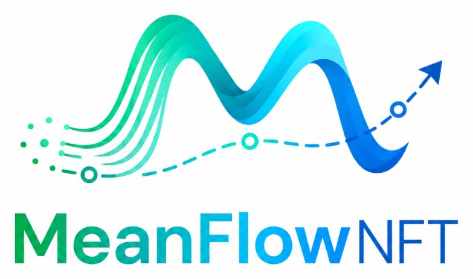
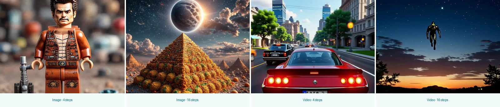
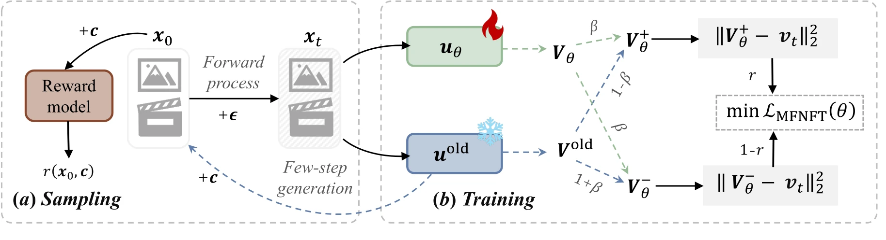
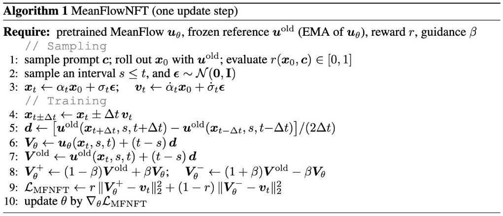
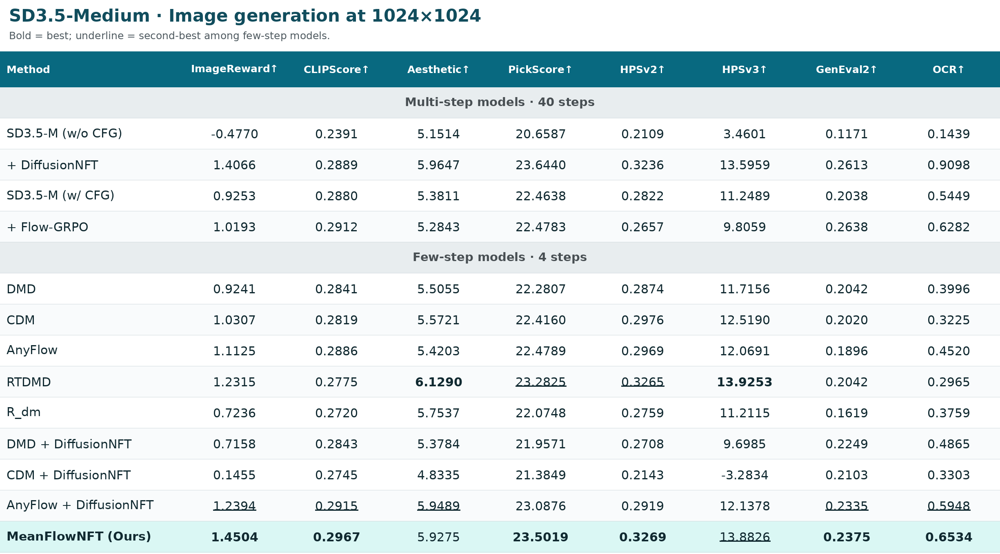
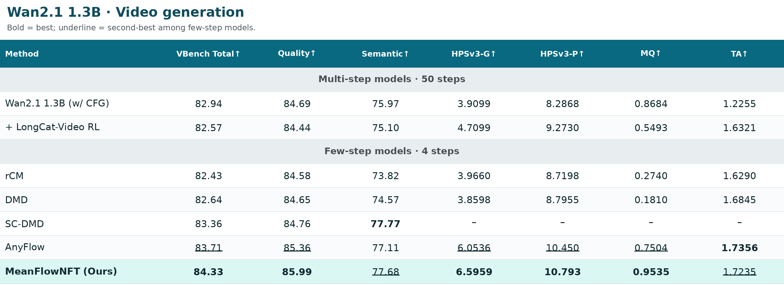

<!-- markdownlint-disable MD033 MD041 -->
<div align="center">



<h2>Bringing Forward-Process RL to Average-Velocity Generators</h2>

[Yushi Huang](https://harahan.github.io/)<sup>1,2</sup>\* ·
[Xiangxin Zhou](https://zhouxiangxin1998.github.io/)<sup>1</sup>\*<sup>✉</sup> ·
[Jun Zhang](https://eejzhang.people.ust.hk/)<sup>2</sup> ·
[Liefeng Bo](https://research.cs.washington.edu/istc/lfb/)<sup>1</sup> ·
[Tianyu Pang](https://p2333.github.io/)<sup>1,✉</sup>

<sup>1</sup>Tencent Hunyuan &nbsp;&nbsp; <sup>2</sup>The Hong Kong University of Science and Technology

\* Equal contribution &nbsp;&nbsp; <sup>✉</sup>Corresponding authors

[](https://arxiv.org/abs/2607.15273)
[](https://harahan.github.io/meanflownft-project-page/)
[](https://huggingface.co/Harahan/MeanFlowNFT)
[](https://huggingface.co/spaces/Harahan/meanflownft-fewstep-generation)

[](LICENSE)
[](https://www.python.org/)

</div>

- 🚀 **Forward-process RL for MeanFlow:** optimize rewards in induced
  instantaneous-velocity space while keeping the model in average-velocity
  space.
- ⚡ **Native any-step generation:** preserve MeanFlow's efficient sampler
  without reverse-trajectory backpropagation or likelihood estimation.
- 📈 **Policy improvement:** inherit DiffusionNFT's strict improvement
  guarantee under the idealized pointwise optimum.

<p align="center">
  <a href="https://harahan.github.io/meanflownft-project-page/"></a>
</p>

See the [project page](https://harahan.github.io/meanflownft-project-page/)
to play the videos and explore the full interactive comparison.

---

## 🍭 Overview

<table align="center">
  <tr>
    <td align="center" width="58%" valign="middle">
      
      <br><sub>Induced instantaneous-velocity optimization with native MeanFlow sampling.</sub>
    </td>
    <td align="center" width="42%" valign="middle">
      
      <br><sub>One practical MeanFlowNFT update step.</sub>
    </td>
  </tr>
</table>

- 🧭 **Optimize in instantaneous-velocity space** through the MeanFlow
  identity while retaining the average-velocity parameterization.
- 🔁 **Use a shared EMA finite-difference derivative** for stable positive and
  negative policy construction.
- 🪶 **Train only from forward-noised clean samples;** inference still calls
  the original MeanFlow sampler.

---

## 📊 Results

<p align="center">
  <a href="assets/results_sd35.png"></a>
</p>

<p align="center">
  <a href="assets/results_wan.png"></a>
</p>

MeanFlowNFT is best on **6 of 8** image metrics among evaluated few-step
models, while 4-step Wan2.1 reaches **84.33 VBench**, surpassing 50-step
LongCat-Video RL. See the
[project page](https://harahan.github.io/meanflownft-project-page/) for full
scaling curves and qualitative comparisons.

---

## 🛠️ Installation

The paper studies both image and video generation; the current code release
provides the SD3.5-Medium training and inference pipeline.
Wan2.1 training and inference support is currently being built on the
[`wan` branch](https://github.com/Harahan/MeanFlowNFT/tree/wan).

The paper environment uses Python 3.10, PyTorch 2.6.0, and CUDA 12.4.

```bash
git clone https://github.com/Harahan/MeanFlowNFT.git
cd MeanFlowNFT

conda create -n meanflownft python=3.10 -y
conda activate meanflownft
pip install -r requirements.txt
pip install -e .
```

`requirements.txt` is the pinned paper environment. If `flash-attn` cannot be
built on your platform, remove that requirement; the model loader falls back
to PyTorch SDPA.

### 📦 Prepare SD3.5-Medium

The complete release workflow expects a **local Diffusers pipeline directory**;
it does not rely on every distributed worker downloading SD3.5 implicitly.
After accepting the model license, download it once:

```bash
hf auth login
hf download stabilityai/stable-diffusion-3.5-medium \
    --local-dir models/stable-diffusion-3.5-medium

export MEANFLOWNFT_SD35_PATH="$(pwd)/models/stable-diffusion-3.5-medium"
```

The model directory must contain the Transformer, VAE, scheduler, text
encoders, and tokenizers of the complete SD3.5-Medium pipeline.

## 🎁 Reward Model Preparation

Training uses PickScore, HPSv2, and CLIPScore. Full evaluation additionally
supports ImageReward, Aesthetic Score, HPSv3, GenEval2, and OCR.

Choose a shared checkpoint/cache root:

```bash
export MEANFLOWNFT_REWARD_CKPT_PATH=/path/to/reward_ckpts
export HF_HOME=/path/to/huggingface_cache
mkdir -p "${MEANFLOWNFT_REWARD_CKPT_PATH}" "${HF_HOME}"
```

Three files are expected directly under
`${MEANFLOWNFT_REWARD_CKPT_PATH}`:

```bash
hf download laion/CLIP-ViT-H-14-laion2B-s32B-b79K \
    open_clip_pytorch_model.bin \
    --local-dir "${MEANFLOWNFT_REWARD_CKPT_PATH}"

hf download xswu/HPSv2 HPS_v2.1_compressed.pt \
    --local-dir "${MEANFLOWNFT_REWARD_CKPT_PATH}"

curl -L \
    https://github.com/christophschuhmann/improved-aesthetic-predictor/raw/refs/heads/main/sac+logos+ava1-l14-linearMSE.pth \
    -o "${MEANFLOWNFT_REWARD_CKPT_PATH}/sac+logos+ava1-l14-linearMSE.pth"
```

The remaining assets are handled as follows:

- PickScore and CLIPScore download through Hugging Face into `${HF_HOME}`.
- ImageReward downloads into
  `${MEANFLOWNFT_REWARD_CKPT_PATH}/ImageReward`.
- HPSv3 downloads its official weights automatically. No local YAML is
  required for the normal online setup.
- OCR downloads PaddleOCR weights into
  `${MEANFLOWNFT_REWARD_CKPT_PATH}/.paddleocr`.
- GenEval2 uses the bundled `dataset/geneval2/test.jsonl` and downloads
  `Qwen/Qwen3-VL-8B-Instruct` through Hugging Face.

For an offline GenEval2 setup, pre-download the VLM to the location detected
by the scorer:

```bash
hf download Qwen/Qwen3-VL-8B-Instruct \
    --local-dir \
    "${MEANFLOWNFT_REWARD_CKPT_PATH}/geneval2/Qwen3-VL-8B-Instruct"
```

To use an existing local HPSv3 checkpoint instead of automatic download, set
both explicit paths:

```bash
export MEANFLOWNFT_HPSV3_CONFIG_PATH=/path/to/HPSv3_7B.yaml
export MEANFLOWNFT_HPSV3_CHECKPOINT_PATH=/path/to/HPSv3.safetensors
```

The config field `reward_ckpt_path` overrides the environment default when it
is set.

## 🚀 Training

Export the common paths:

```bash
export MEANFLOWNFT_SD35_PATH=/path/to/stable-diffusion-3.5-medium
export MEANFLOWNFT_DATA_DIR=/path/to/sd35m_laion_aes_6p5_40step_cfg4.5_512
export MEANFLOWNFT_REWARD_CKPT_PATH=/path/to/reward_ckpts
```

### 1️⃣ Generate the AnyFlow training data

The released recipe uses LAION-AES-6.5+ prompts, a 40-step SD3.5-Medium
teacher with CFG 4.5, 512×512 resolution, and latent `.pt` samples.

Run the following command on every node, changing `NODE_RANK` from `0` to
`NNODES-1`:

```bash
export NNODES=2
export NODE_RANK=0
export MASTER_ADDR=10.0.0.1
export MASTER_PORT=29500

NNODES="${NNODES}" NODE_RANK="${NODE_RANK}" \
MASTER_ADDR="${MASTER_ADDR}" MASTER_PORT="${MASTER_PORT}" \
bash scripts/generate_sd35_consistency_data.sh \
    8 dataset/laion_aes_6p5/train.txt "${MEANFLOWNFT_DATA_DIR}"
```

Set `NCCL_SOCKET_IFNAME` in the job environment when a specific interface is
required.
Generation is deterministic and resume-safe; `dataset_manifest.json` rejects
incompatible resumes.

### 2️⃣ Initialize the MeanFlow policy

First run AnyFlow forward pretraining:

```bash
bash scripts/train_sd35_anyflow_pretrain.sh \
    8 configs/anyflow/sd35m_anyflow_pretrain.yaml \
    --override \
    model.pretrained_path="${MEANFLOWNFT_SD35_PATH}" \
    prompt_path="${MEANFLOWNFT_DATA_DIR}" \
    eval.reward_ckpt_path="${MEANFLOWNFT_REWARD_CKPT_PATH}"
```

Use its EMA checkpoint to start AnyFlow on-policy distillation:

```bash
export PRETRAIN_LORA=/path/to/anyflow-pretrain/checkpoint-6000/generator_ema.pt

bash scripts/train_sd35_anyflow_onpolicy.sh \
    8 configs/anyflow/sd35m_anyflow_onpolicy.yaml \
    --override \
    model.pretrained_path="${MEANFLOWNFT_SD35_PATH}" \
    model.generator_lora.load_path="${PRETRAIN_LORA}" \
    prompt_path="${MEANFLOWNFT_DATA_DIR}" \
    eval.reward_ckpt_path="${MEANFLOWNFT_REWARD_CKPT_PATH}"
```

The pretraining LoRA is merged into the base before a fresh on-policy LoRA is
optimized.

### 3️⃣ Train MeanFlowNFT

```bash
export ONPOLICY_LORA=/path/to/anyflow-onpolicy/checkpoint-12000/generator_ema.pt

bash scripts/train_sd35_meanflow_nft.sh \
    8 configs/meanflow_nft/sd35m_meanflow_nft.yaml \
    --override \
    model.pretrained_path="${MEANFLOWNFT_SD35_PATH}" \
    "model.generator_lora.pre_merge_paths=[${PRETRAIN_LORA}]" \
    model.generator_lora.load_path="${ONPOLICY_LORA}" \
    meanflow_nft.reward_ckpt_path="${MEANFLOWNFT_REWARD_CKPT_PATH}" \
    eval.reward_ckpt_path="${MEANFLOWNFT_REWARD_CKPT_PATH}"
```

The two AnyFlow LoRAs are merged in order, then MeanFlowNFT optimizes a fresh
LoRA with PickScore, HPSv2, and CLIPScore. All training launchers support
multi-node execution through `NNODES`, `NODE_RANK`, `MASTER_ADDR`, and
`MASTER_PORT`.

To resume any run, append this item to that command's existing `--override`
list:

```bash
train.resume_from=/path/to/checkpoint
```

## 🔮 Inference and Evaluation

The final policy is reconstructed by loading the three LoRAs in training
order. The first two are merged into SD3.5-Medium; the MeanFlowNFT LoRA remains
active and supplies the final `delta_embedder`.

```bash
export PRETRAIN_LORA=/path/to/anyflow-pretrain/generator_ema.pt
export ONPOLICY_LORA=/path/to/anyflow-onpolicy/generator_ema.pt
export MEANFLOWNFT_LORA=/path/to/meanflownft/generator_ema.pt

python inference.py configs/inference/sd35m_meanflow_nft.yaml \
    --override \
    pretrained_path="${MEANFLOWNFT_SD35_PATH}" \
    num_stages=3 \
    stage1_lora_path="${PRETRAIN_LORA}" \
    stage2_lora_path="${ONPOLICY_LORA}" \
    stage3_lora_path="${MEANFLOWNFT_LORA}" \
    num_steps=4 \
    eval_reward=false \
    --prompt "a cinematic photo of a red panda"
```

To evaluate all eight configured metrics, use the same final policy with the
datasets routed by the inference config:

```bash
python inference.py configs/inference/sd35m_meanflow_nft.yaml \
    --override \
    pretrained_path="${MEANFLOWNFT_SD35_PATH}" \
    num_stages=3 \
    stage1_lora_path="${PRETRAIN_LORA}" \
    stage2_lora_path="${ONPOLICY_LORA}" \
    stage3_lora_path="${MEANFLOWNFT_LORA}" \
    num_steps=4 \
    reward_ckpt_path="${MEANFLOWNFT_REWARD_CKPT_PATH}" \
    eval_reward=true
```

Generated images and `metadata.json` are written under the configured
`output_dir`. The supplied inference config uses 1024×1024 output and the
training-aligned four-step, CFG-free MeanFlow sampler.

## 📄 Citation

```bibtex
@misc{huang2026meanflownftbringingforwardprocessrl,
  title  = {MeanFlowNFT: Bringing Forward-Process RL to Average-Velocity Generators},
  author = {Huang, Yushi and Zhou, Xiangxin and Zhang, Jun and Bo, Liefeng and Pang, Tianyu},
  year={2026},
  eprint={2607.15273},
  archivePrefix={arXiv},
  primaryClass={cs.CV},
  url={https://arxiv.org/abs/2607.15273}, 
}
```

## 🙌 Acknowledgements

This implementation builds on
[MeanFlow](https://github.com/Gsunshine/meanflow),
[AnyFlow](https://github.com/NVlabs/AnyFlow),
[DiffusionNFT](https://github.com/NVlabs/DiffusionNFT),
[Diffusers](https://github.com/huggingface/diffusers),
[Transformers](https://github.com/huggingface/transformers), and
[PEFT](https://github.com/huggingface/peft).

## ⚖️ License

This project is released under the [Apache License 2.0](LICENSE). Model and
reward checkpoints remain subject to their original licenses and terms.
